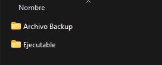
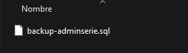
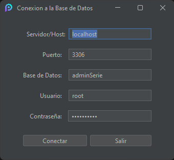
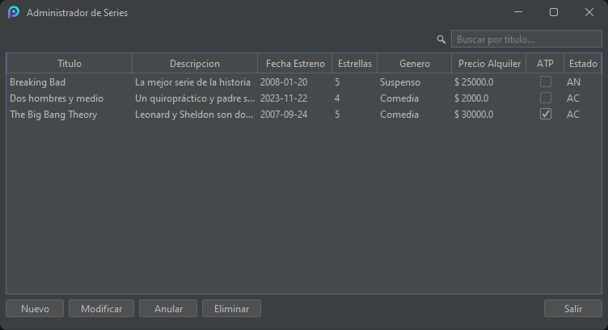

# Instrucciones para el correcto uso de la aplicación.

1. **Abrir la Carpeta "Aplicación"**
   - Dentro encontrarás dos subcarpetas: una llamada **Archivo Backup** (que contiene el respaldo de la base de datos en formato SQL) y otra llamada **Ejecutable** (donde está ubicado el archivo .exe).

     

2. **Acceder a la Carpeta "Archivo Backup"**
   - Importa el archivo `backup-adminserie.sql` en tu motor de base de datos **MySQL** (Es esencial que la importación se realice en MySQL).

     

3. **Acceder a la Carpeta "Ejecutable"**
   - Ejecuta el archivo `AdminSeries.exe`.
 
     
     
   - Al abrir la aplicación, deberás ingresar los datos correspondientes a tu base de datos, como el servidor, puerto, base de datos, usuario y contraseña.
  
     

5. **Utilizar la Aplicación**
   - Aprovecha las funciones de la aplicación para crear, visualizar, modificar, eliminar y buscar series.
   
     

## Ejemplo de su funcionamiento.

---

*Muchas gracias por su tiempo.* :)
